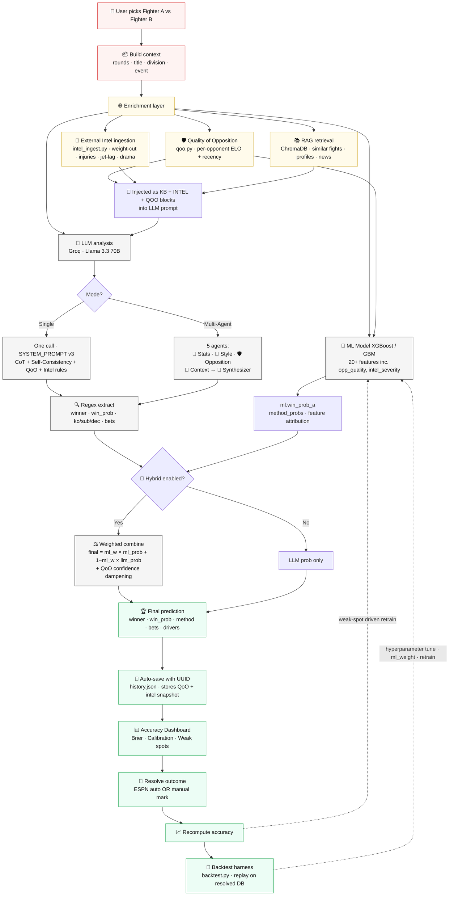
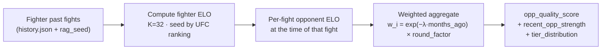
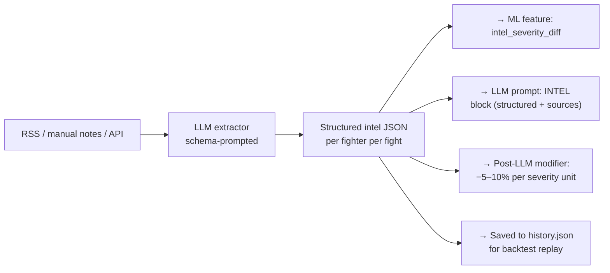
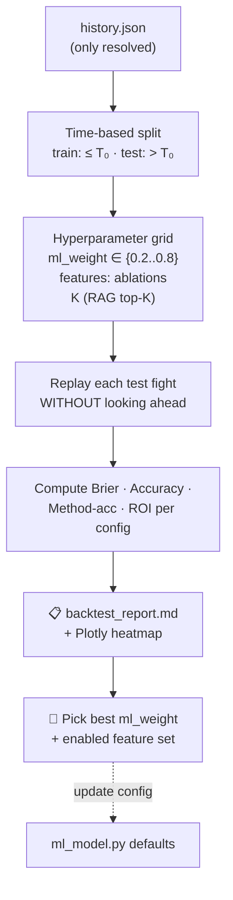
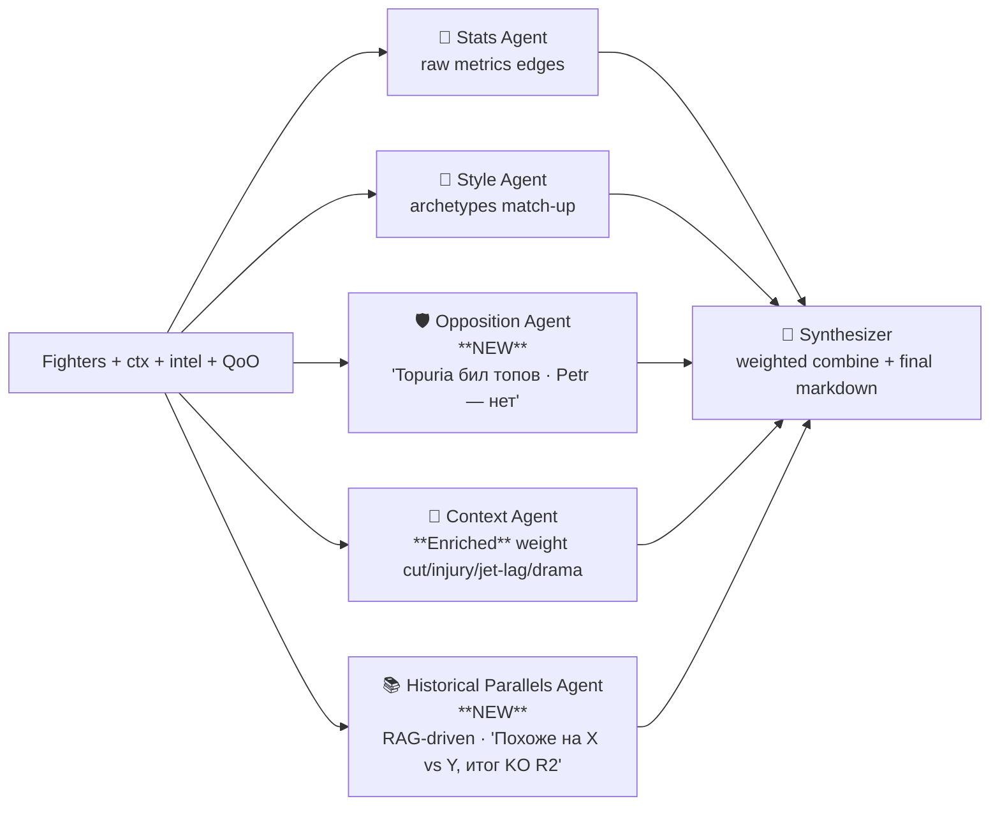
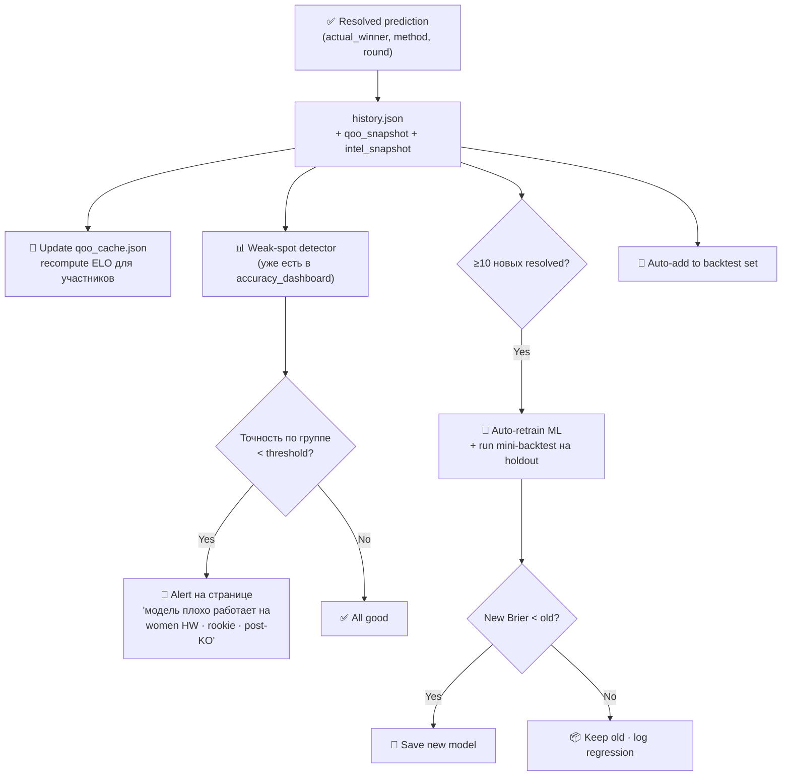
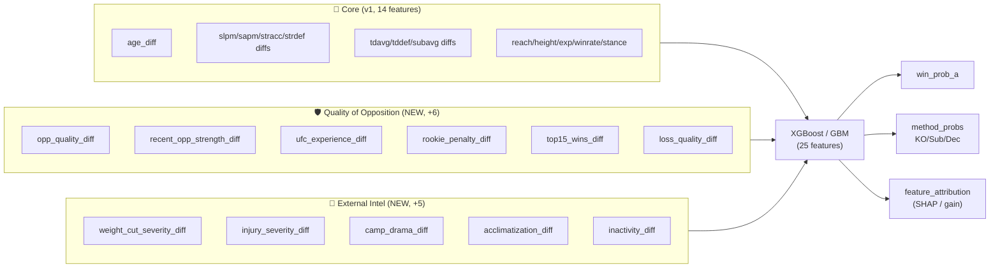
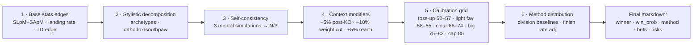
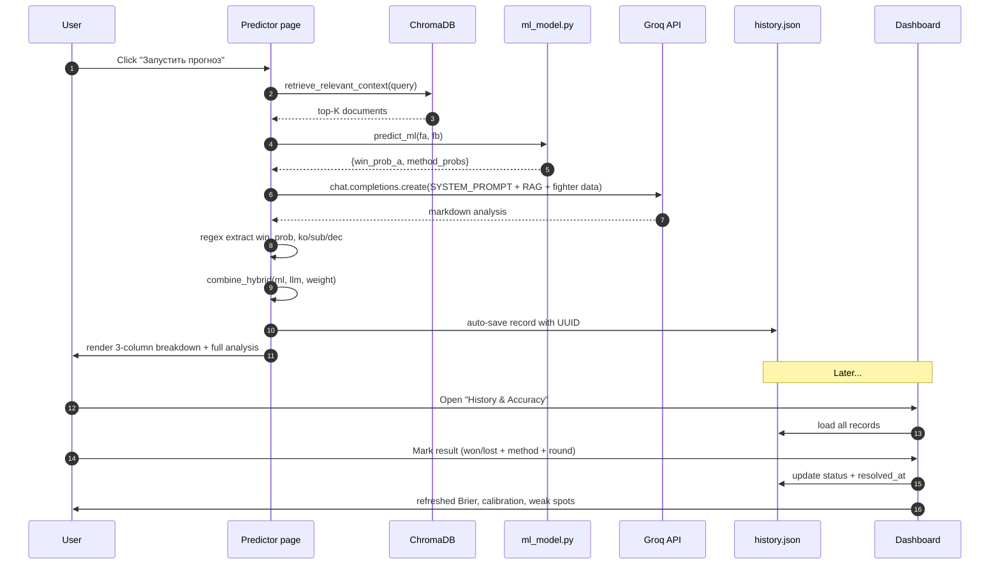

# UFC Predictor — Architecture & Prediction Pipeline

End-to-end схема того, как приложение приходит к финальному прогнозу боя.

> GitHub, GitLab, VSCode (с расширением Markdown Preview Mermaid) и большинство Markdown-вьюеров рендерят диаграммы ниже автоматически.

---

## 🎯 Prediction Pipeline (v3 — with QoO + External Intel + Backtesting)



> **Что нового в v3:** введён **enrichment layer** между context и downstream-ветками. QoO и Intel становятся **first-class citizens** — питают и ML, и LLM, и сохраняются в каждом record для последующего backtest'а.

---

## 🛡️ Quality of Opposition (QoO) — новый модуль `qoo.py`

### Зачем
Текущая модель имеет `winrate_a/b` фичу, но не учитывает **уровень побеждённых**. 5-0 против tier-3 ≠ 3-2 против top-15. Особенно критично для дебютантов в UFC: их MMA-рекорд может быть 18-0, но если все бои на региональных промоушенах — это слабый сигнал.

### Подход: рекурсивный ELO + recency decay



### Хранение
Новый файл `qoo_cache.json`:
```json
{
  "fighter_id": "ilia_topuria",
  "elo": 1742,
  "opponents": [
    {"name": "Volkanovski",   "their_elo_then": 1810, "result": "W", "method": "KO", "round": 2, "date": "2024-02-17", "weight_class": "Featherweight"},
    {"name": "Holloway",      "their_elo_then": 1755, "result": "W", "method": "KO", "round": 3, "date": "2024-10-26"},
    ...
  ],
  "metrics": {
    "opp_quality_score": 0.78,        // взвешенное среднее opponent ELO, нормализовано [0,1]
    "recent_opp_strength": 0.85,      // последние 3 боя, более жёсткий decay
    "tier_distribution": {"top5": 2, "top15": 1, "ranked": 0, "unranked": 0},
    "ufc_fights_count": 8,
    "regional_fights_count": 0,
    "rookie_penalty": 0.0             // 1.0 если <3 UFC боёв, 0 если >=8
  },
  "updated_at": "2026-05-10T19:30:00"
}
```

### Новые ML-фичи (добавить в `ml_model.py :: FEATURE_NAMES`)

| Фича | Формула | Сигнал |
|---|---|---|
| `opp_quality_diff` | `qoo_a.opp_quality_score − qoo_b.opp_quality_score` | Кто бил кого получше |
| `recent_opp_strength_diff` | то же на последних 3 боях | Текущий тренд оппозиции |
| `ufc_experience_diff` | `ufc_fights_a − ufc_fights_b` | Адаптация к UFC-уровню |
| `rookie_penalty_diff` | `rookie_b − rookie_a` | Положительно — против дебютанта |
| `top15_wins_diff` | wins vs ranked − same | Чистый "scalp count" эджа |
| `loss_quality_diff` | сред. ELO тех, кому проиграл (выше = лучше — "проигрывал только топам") | Качество поражений |

→ итого **14 + 6 = 20 фич**. Симметризация (A-vs-B и B-vs-A) сохраняется.

### Confidence dampening при дебютанте
В `combine_hybrid()` добавляем:
```python
if qoo_a.rookie_penalty > 0.5 or qoo_b.rookie_penalty > 0.5:
    # Дебютант — снижаем уверенность к 50% на 30% от расстояния
    rookie_factor = max(qoo_a.rookie_penalty, qoo_b.rookie_penalty)
    final_prob = 0.5 + (final_prob - 0.5) * (1 - 0.3 * rookie_factor)
```
Это автоматически режет overconfidence на бойцах с тонкой UFC-выборкой.

---

## 📰 External Intel ingestion — `intel_ingest.py`

### Что собираем (структурированно)

```python
# intel_ingest.py
INTEL_SCHEMA = {
    "weight_cut": {
        "severity": float,        # 0.0 = норма, 1.0 = катастрофа
        "missed_weight": bool,
        "double_cut": bool,
        "notes": str,
    },
    "injury": {
        "severity": float,        # 0.0–1.0
        "body_part": str,         # "knee" | "hand" | "back" | ...
        "training_camp_impact": float,  # сколько недель пропущено
    },
    "travel": {
        "timezone_diff_hours": int,
        "arrival_days_before": int,   # <7 = плохая акклиматизация
        "altitude_change_m": int,
    },
    "camp_drama": {
        "coach_change": bool,
        "team_split": bool,
        "contract_dispute": bool,
        "personal_issues_flag": bool,
        "severity": float,
    },
    "motivation": {
        "title_shot_implication": bool,
        "comeback_after_ko": bool,
        "months_inactive": int,
        "fight_for_legacy": bool,
    },
    "_meta": {
        "sources": [{"url": "...", "title": "...", "date": "..."}],
        "extracted_at": "ISO date",
        "confidence": float,      // насколько уверены в извлечении
    },
}
```

### Источники (постепенно)
1. **Manual** (есть сейчас) — поле "Intel notes" в Predictor → сохраняется как free text
2. **Semi-auto** — кнопка "🔍 Pull intel" вызывает LLM-extractor, который парсит RSS / новостные сводки в этот schema
3. **API integrations (future)**: ESPN headlines, Reddit r/MMA hot, Twitter/X

### Где питается это в pipeline



### Новые ML-фичи от Intel

| Фича | Источник |
|---|---|
| `weight_cut_severity_diff` | `intel.weight_cut.severity` |
| `injury_severity_diff` | `intel.injury.severity` |
| `camp_drama_diff` | `intel.camp_drama.severity` |
| `acclimatization_diff` | функция от `timezone_diff` × (7 − `arrival_days_before`)/7 |
| `inactivity_diff` | `months_inactive_a − months_inactive_b` |

→ **20 + 5 = 25 фич**. Если intel пуст → нули (модель учится игнорировать).

### Post-LLM hard modifier (детерминированный override)
LLM может пропустить severe intel; добавляем sanity check после combine:
```python
def apply_intel_modifier(final_prob_a, intel_a, intel_b):
    delta = 0.0
    delta -= 0.07 * intel_a.weight_cut.severity      # тяжёлая весогонка A
    delta -= 0.05 * intel_a.injury.severity
    delta -= 0.04 * intel_a.camp_drama.severity
    delta += 0.07 * intel_b.weight_cut.severity      # та же логика для B
    delta += 0.05 * intel_b.injury.severity
    delta += 0.04 * intel_b.camp_drama.severity
    return clamp(final_prob_a + delta, 0.05, 0.95)
```
**Cap [0.05, 0.95]** — никогда не уверены на 100%.

---

## 🧪 Backtesting harness — `backtest.py`

### Зачем
Сейчас feedback loop только forward — каждое следующее предсказание чуть улучшает ML. Backtest позволяет **воспроизвести модель на прошлых боях с уже известным результатом** и измерить:
- Brier за 6 месяцев на разных значениях `ml_weight`
- Accuracy gain от добавления QoO/Intel фич (ablation study)
- Calibration drift во времени

### Поток



### Ключевая дисциплина: **no leakage**
- При replay'е боя на дату T используем только данные **до T**:
  - QoO считается из боёв **строго раньше** T
  - Intel — snapshot, который был в момент сохранения исходного prediction
  - ML-модель — обученная только на `resolved_history` где `resolved_at < T`
- Это требует хранить **point-in-time copies** в каждом record (поэтому в record добавляем `qoo_snapshot` и `intel_snapshot`).

### UI
Новая страница `🧪 Backtest` в сайдбаре:
- Выбор временного окна
- Чекбоксы фич для ablation
- Запуск → прогресс бар → таблица результатов + Plotly heatmap (ml_weight × feature_set → Brier)
- Кнопка "Apply best config" → сохраняет в `backtest_best.json` → ML использует на следующем прогнозе

---

## 🤖 Multi-Agent v2 — добавляем 2 агента

### До (текущая версия)
```
Stats Agent · Style Agent · Context Agent → Synthesizer  (4 calls)
```

### После


**Зачем разделять Opposition и Historical Parallels:**
- `Opposition Agent` отвечает на «**Кого они били**» — fact-driven, sourced from QoO data
- `Historical Parallels Agent` отвечает на «**Похоже на какой бой**» — pattern-matching через RAG
- Оба сигнала независимы и часто противоречат друг другу — Synthesizer должен явно их взвешивать

---

## 🧠 SYSTEM_PROMPT v3 — обновления

В `app.py :: SYSTEM_PROMPT` добавить **3 новых блока** перед "ФОРМАТ ВЫВОДА":

### Блок A — Quality of Opposition
```
═══════════════════════════════════════════════════════════════════
🛡️ КАЧЕСТВО ОППОЗИЦИИ (обязательное правило)
═══════════════════════════════════════════════════════════════════
В промпте присутствует блок === QOO === со списком прошлых соперников
каждого бойца, их ELO на момент боя, метода и даты.

ПРАВИЛА:
- Если боец А бил топ-15 / чемпионов несколько раз, а Б — только
  unranked, это **сильный сигнал в пользу А** даже при равной статистике.
  Поднимай вероятность A на +5–10%.
- Если в QOO у бойца <3 UFC боёв (rookie_penalty > 0.5):
  «small sample warning». **Снижай уверенность на 5–8%** относительно
  любого пика — даже если статы выглядят красиво на бумаге.
- Если боец проигрывал ТОЛЬКО топам — это меньший минус, чем потери
  unranked'ам. Используй loss_quality_score.
- Цитируй конкретные имена: «Топурия снёс Володьку и Холлоуэя — это top-tier
  сопротивление; у Пётра последние 3 боя — региональные промоушены».
```

### Блок B — External Intel
```
═══════════════════════════════════════════════════════════════════
📰 ВНЕШНИЙ КОНТЕКСТ (структурированный INTEL block)
═══════════════════════════════════════════════════════════════════
В промпте присутствует блок === INTEL === со структурированным JSON
по каждому бойцу: weight_cut, injury, travel, camp_drama, motivation.

КАК ИНТЕРПРЕТИРОВАТЬ severity (0.0–1.0):
- weight_cut.severity ≥ 0.7 → красный флаг: −7–10% к шансам, повышение
  вероятности cardio crash в R4-R5, выше LATE finish/Decision против него
- injury.severity ≥ 0.5 → −5–8%, особенно в striking matchup-ах
- travel.timezone_diff ≥ 8 + arrival < 5 days → −3–5% за плохую
  акклиматизацию (jet lag реально влияет на reflexes в R1)
- camp_drama.coach_change или team_split → −3–7%
- motivation.title_shot_implication → +2–4% (sharper preparation)
- motivation.comeback_after_ko → −5% к chin durability на 12 месяцев

ВСЕГДА цитируй sources из INTEL._meta.sources в формате [Source N].
Если INTEL пуст для бойца → отметь явно: «по бойцу X нет свежих данных,
интерпретирую с осторожностью».
```

### Блок C — Учёт уверенности при rookie
```
═══════════════════════════════════════════════════════════════════
🆕 ДЕБЮТАНТЫ И МАЛАЯ ВЫБОРКА
═══════════════════════════════════════════════════════════════════
Если в QOO для одного из бойцов ufc_fights_count < 3:
- Это «sample-size trap» — статистика ненадёжна.
- Финальная уверенность не должна превышать **65%** даже при
  визуально доминирующем стилевом эдже.
- Method probabilities делай ближе к baselines дивизиона
  (без сильного перекоса в KO без явного KO-power evidence).
- В разделе «⚠️ Риски» отдельно отметь: «выборка по дебютанту мала
  → реальная uncertainty выше, чем показывает базовая модель».
```

---

## 🔁 Feedback Loop v2 — улучшения

### Сейчас
```
resolved prediction → история → ручной retrain ML
```

### После


### Что меняется в коде

1. **`accuracy_dashboard.py`** — добавить блок «🚨 Model Health Alerts» сверху, который автоматически детектит:
   - Группы с `accuracy < 50%` (хуже монетки) и n ≥ 5
   - Резкое падение rolling-10 accuracy (>15 п.п. падение)
   - Calibration error > 0.10 в каком-то бакете

2. **`ml_model.py`** — добавить функцию `auto_retrain_check()`:
   ```python
   def auto_retrain_check(history, threshold_new_resolved=10):
       """Возвращает True если есть смысл переобучить."""
       last_train_at = get_meta().get("trained_at")
       new_since = count_resolved_since(history, last_train_at)
       return new_since >= threshold_new_resolved
   ```
   Вызывается на старте Streamlit → toast «📊 +12 новых resolved → рекомендую retrain».

3. **`history.json` schema** — добавляем в каждый record:
   - `qoo_snapshot`: dict — копия QoO на момент прогноза (для leakage-safe backtest)
   - `intel_snapshot`: dict — копия INTEL JSON
   - `feature_vector`: list[float] — точный input ML-модели (для ablation studies)
   - `model_version`: str — `meta.trained_at` ISO — какая версия ML это сделала

---

## 🧩 Components (file map)

| Слой | Файл | Роль |
|---|---|---|
| Entry & UI | `app.py` | Streamlit-приложение, все страницы, sidebar, routing |
| Env/Config | `.env.local` | `LLM_API_KEY`, `LLM_BASE_URL`, `LLM_MODEL` (gitignored) |
| System prompt | `app.py :: SYSTEM_PROMPT` | **v3** · CoT + Self-Consistency + Calibration + QoO + Intel rules |
| Multi-Agent | `agents.py` | **v2** · Stats / Style / **Opposition** / Context / **Historical Parallels** / Synthesizer |
| RAG | `rag_utils.py`, `rag_ui.py`, `rag_seed.py` | ChromaDB retrieval + seed knowledge base + **news ingestion** |
| ML Model | `ml_model.py` | XGBoost/GBM · **25 features** · feature attribution · auto-retrain |
| **Quality of Opposition** | **`qoo.py` (NEW)** | **ELO-based opp_quality + UFC experience + tier distribution** |
| **External Intel** | **`intel_ingest.py` (NEW)** | **Schema-prompted LLM extractor: weight cut, injuries, jet-lag, drama** |
| **Backtesting** | **`backtest.py` (NEW)** | **Time-aware replay harness · ablation grid · ml_weight tuning** |
| Live data | `live_data.py` | ESPN scoreboard/calendar — live fights + auto-resolve |
| Dashboard | `accuracy_dashboard.py` | Accuracy metrics, calibration, weak spots, **Model Health Alerts** |
| Fine-tune | `finetune_utils.py`, `finetune_ui.py` | Дообучение кастомных LLM |
| Persistence | `fighters.json`, `upcoming_events.json`, `history.json` (+ snapshots), **`qoo_cache.json` (NEW)**, **`intel_cache.json` (NEW)**, `ml_models/`, `chroma_db/` | Локальное хранилище |

---

## 🔢 ML Model — 25 features (v3)

Все фичи — **diff-features** (метрика A минус метрика B), симметризация через удвоение датасета (A-vs-B и B-vs-A).



> Если QoO/Intel данные отсутствуют для какого-то бойца → значения = 0 (нейтрально). Модель учится не полагаться на них в условиях неопределённости.

---

## 🎯 Hybrid combiner (math)

Если включён Hybrid toggle и ML-модель натренирована:

```
final_prob_a = ml_weight × ml.win_prob_a + (1 − ml_weight) × llm.prob_a
```

- `ml_weight` ∈ [0, 1] — ползунок в UI (default **0.4**)
- `llm.prob_a` — вероятность бойца A, выведенная regex-парсером из ответа LLM (инвертируется если LLM выбрал B)
- `final_prob_a` → пишется в `history.json` как `win_prob` для предсказанного победителя (→ Brier score считается на финальной hybrid-вероятности)

---

## 🧠 LLM reasoning (SYSTEM_PROMPT v2)

Внутренний Chain-of-Thought (не показывается пользователю):



---

## 💾 Data flow on save



---

## 🔁 Feedback loop

Каждый resolved прогноз с `actual_winner` становится training sample для ML-модели:

1. User отмечает результат → `status: won/lost` + `actual_winner` в `history.json`
2. Юзер идёт на страницу **🧮 ML Model** → нажимает **🚀 Train**
3. `ml_model.assemble_training_data(...)` собирает:
   - `rag_seed.HISTORICAL_FIGHTS` (статичный seed)
   - `st.session_state.history` (resolved predictions)
4. Тренирует XGBoost, сохраняет в `ml_models/`
5. Следующий прогноз уже использует обновлённую модель через Hybrid toggle

---

## 📊 Accuracy metrics explained

| Метрика | Формула | Что значит |
|---|---|---|
| **Accuracy** | correct / resolved | % правильных победителей |
| **Brier Score** | mean((pred − actual)²) | 0 = perfect, 0.25 = coin flip. Штрафует overconfidence жёстче |
| **Calibration error** | actual_rate − predicted_avg по бакету | Насколько вероятности соответствуют реальности |
| **Moneyline acc** | `predicted_winner == actual_winner` | Базовая точность |
| **Method acc** | `argmax(ko, sub, dec) == normalize(actual_method)` | Попадание в тип финиша |
| **Confidence band** | win rate при уверенности в диапазоне | Проверка калибровки по квантилям |

---

## �️ Implementation Roadmap (v3)

Конкретный порядок задач для Windsurf — каждый этап даёт измеримый выигрыш и не ломает существующее.

### Phase 1 — Quality of Opposition (1–2 дня)
1. **`qoo.py`** — функции `compute_elo()`, `build_qoo(fighter, history, rag_seed, as_of_date)`, `get_qoo_cache()`, `update_qoo_after_resolve(record)`. Кеш в `qoo_cache.json`.
2. **`ml_model.py`** — расширить `FEATURE_NAMES` на 6 QoO фич, обновить `build_features(fa, fb, qoo_a, qoo_b)`. Обучить заново.
3. **`app.py`** — в Predictor вызывать `build_qoo()` для обоих бойцов до LLM-call'а, инжектить `=== QOO ===` блок в промпт.
4. **`SYSTEM_PROMPT`** — добавить блок A (см. выше).
5. **`combine_hybrid()`** — добавить rookie dampening.
6. **Сохранять `qoo_snapshot`** в record.

### Phase 2 — External Intel (1–2 дня)
1. **`intel_ingest.py`** — schema + `extract_intel_from_text(notes, llm_client)` (LLM-based JSON extractor) + `extract_intel_from_url(url)` (опционально, через `requests` + LLM).
2. **`app.py`** — в Predictor добавить кнопку **🔍 Pull intel** рядом с полем "Intel notes". Результат → структурированный JSON.
3. **`ml_model.py`** — добавить 5 Intel фич.
4. **`SYSTEM_PROMPT`** — добавить блок B.
5. **`apply_intel_modifier()`** — детерминированный post-LLM override.
6. **Сохранять `intel_snapshot`** в record.

### Phase 3 — Backtesting (1 день)
1. **`backtest.py`** — `run_backtest(history, configs, time_split)` → DataFrame с per-config метриками. Strict no-leakage: filter resolved < T для тренировки, только resolved == T для теста.
2. **Новая страница `🧪 Backtest`** в сайдбаре — UI для grid runner, Plotly heatmap.
3. **Сохранять `backtest_best.json`** — оптимальный `ml_weight` подгружается на старте.

### Phase 4 — Multi-Agent v2 (0.5 дня)
1. **`agents.py`** — добавить `OppositionAgent` и `HistoricalParallelsAgent`. Обновить `Synthesizer` чтобы консьюмил их output.
2. UI — обновить Multi-Agent transparency expander под 5 агентов.

### Phase 5 — Feedback Loop v2 (1 день)
1. **`accuracy_dashboard.py`** — секция «🚨 Model Health Alerts» сверху.
2. **`ml_model.py`** — `auto_retrain_check()` + автотост на старте.
3. **Auto-retrain pipeline** — кнопка "Auto-retrain on new data" с holdout-сравнением (deploy только если Brier лучше).

### Total scope
~5–6 дней ровной работы. Каждая фаза самодостаточна — можно мерджить и юзать сразу.

---

## �🔐 Security & config

- `.env.local` — локальные секреты, **в .gitignore**
- Загружается минимальным парсером `_load_env_local()` в `app.py` — **без зависимости от python-dotenv**
- System env-vars имеют приоритет (через `os.environ.setdefault`) — позволяет override в prod-деплое
- `LLM_API_KEY` никогда не логируется и не попадает в `history.json`
